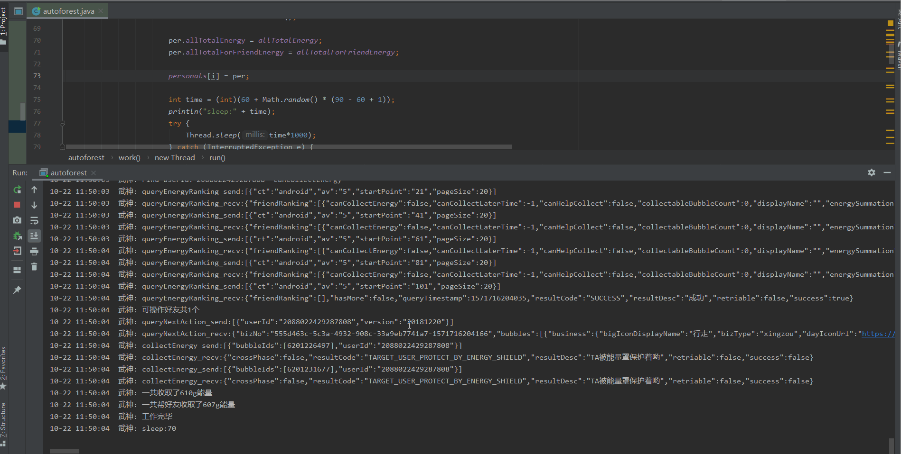

说明:

本项目需要unidbg项目支持,项目地址:https://github.com/zhkl0228/unidbg

分析过程: https://blog.csdn.net/dieTicket/article/details/102678054

Signso.java负责so库doCommandNative的调用

personal.java为个人信息类,主要包含内容以及解释见源码

autoforest.java为项目主工程,代码自解释以及注释已经很齐全,不在赘述.可完成全天候多帐号自动收能量以及帮好友收能量

ali.java为xposed模块,可以hook日志参数以及so库调用参数,用于cookie,miniwua,Did等信息获取

